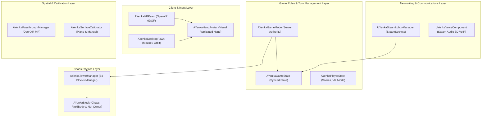
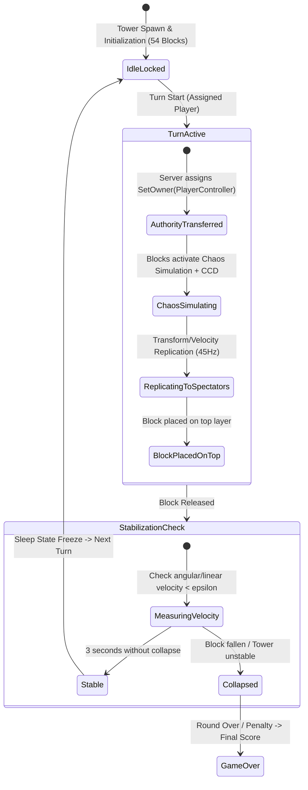
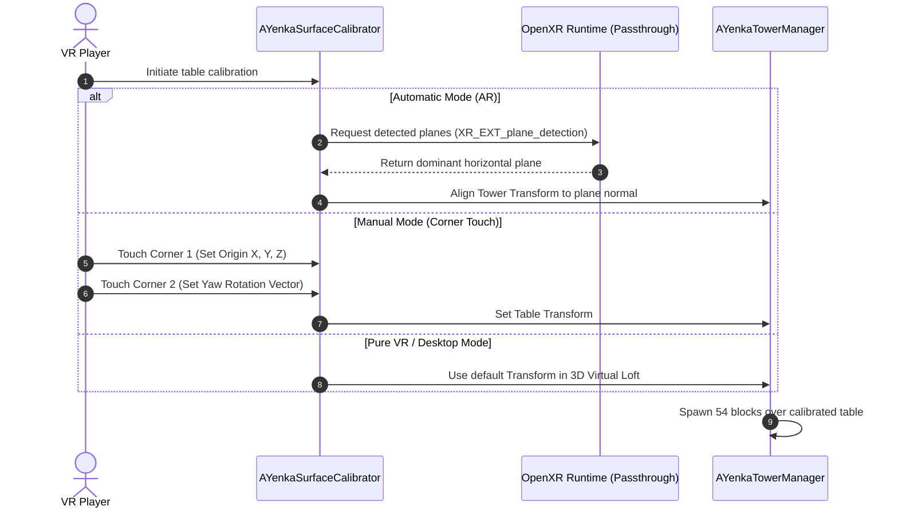
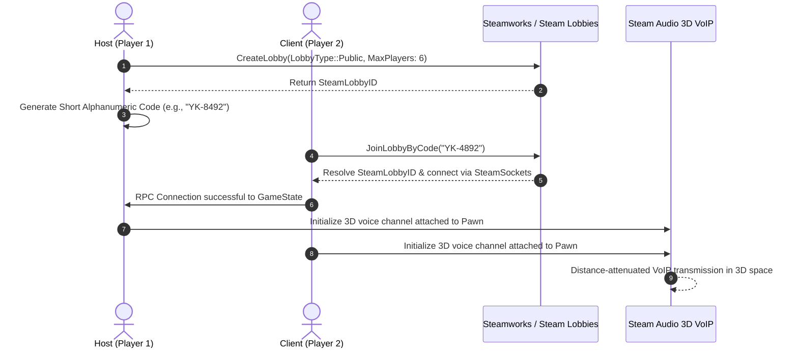

# System Architecture - YenkaVR

This document describes in depth the technical architecture, Unreal Engine 5 subsystems, networking model, and physics lifecycle implemented in **YenkaVR**.

---

## 1. High-Level Architecture Overview



---

## 2. Chaos Physics Lifecycle & Turn Authority

In a precision block-physics game, jitter and latency are critical. The physics architecture follows a strict state machine:



### Physical Material Properties (`UPhysicalMaterial`)
* **Mass per Block:** $0.085 \text{ kg}$ (Balsa/birch wood).
* **Static Friction ($\mu_s$):** $0.65$
* **Dynamic Friction ($\mu_d$):** $0.48$
* **Restitution ($e$):** $0.02$ (Near-zero bounce to prevent artificial jitter).
* **Continuous Collision Detection (CCD):** Enabled on all blocks.
* **Solver Iterations:** `PositionSolverIterationCount = 16`, `VelocitySolverIterationCount = 8`.

---

## 3. Spatial Calibration Pipeline & Mixed Reality (OpenXR)



---

## 4. Pawn Architecture & Hand Representation (VR vs No-VR)

* **`AYenkaVRPawn`:**
  * `UCameraComponent` bound to the HMD.
  * `UMotionControllerComponent` (Left and Right) with OpenXR Hand Tracking support.
  * Bimanual *Pinch-to-Zoom* and *World Drag* logic for spectators.
* **`AYenkaDesktopPawn`:**
  * `USpringArmComponent` + orbital `UCameraComponent`.
  * Mouse input for raycasting, horizontal hand lock, and `PhysicsHandle` extraction.
  * Dedicated **Finger Poke Action (`E` / `F`)** for guided longitudinal pushing of lower-level blocks.
* **`AYenkaHandAvatar`:**
  * 3D articulated hand mesh with procedural finger poses (`OpenHand`, `GrabPinch`, `FingerPoke`).
  * Network-replicated: smoothly interpolates position, rotation, and pose mode across all clients.

---

## 5. Network Architecture & Spatial VoIP



---

## 6. Third-Party Libraries, Plugins, Subsystems & Licensing

The table below catalogs all engine modules, plugins, networking stacks, and 3D assets integrated into **YenkaVR**, including their vendor, technical purpose, and licensing terms:

| Component / Subsystem | Source / Provider | Module / Plugin Target | Purpose in YenkaVR | License Terms |
| :--- | :--- | :--- | :--- | :--- |
| **Unreal Engine 5.5** | Epic Games | Engine Core (`Core`, `CoreUObject`, `Engine`) | Base game engine, Lumen dynamic global illumination, Nanite geometry, C++ gameplay framework. | Unreal Engine EULA (Free up to \$1M gross revenue, 5% royalty thereafter). |
| **Chaos Physics** | Epic Games | `PhysicsCore`, `Chaos` | Real-time rigid body dynamics, Continuous Collision Detection (CCD), sleep state stabilization, and micro-clearance resolution for the 54 blocks. | Unreal Engine EULA (bundled with UE5). |
| **Enhanced Input** | Epic Games | `EnhancedInput`, `InputCore` | Contextual input action mapping for mouse/keyboard on PC and 6DOF motion controllers in VR. | Unreal Engine EULA. |
| **OpenXR (`OpenXRHMD`)** | Khronos Group / Epic Games | `OpenXRHMD` (Private Dependency) | Cross-platform runtime standard for VR/MR hardware (Meta Quest Link/AirLink, Valve Index, HTC Vive, Pico 4). | Khronos OpenXR Specification / Unreal Engine EULA. |
| **OpenXR Hand Tracking** | Khronos Group / Epic Games | `OpenXRHandTracking` (Plugin & Module) | Native skeletal hand tracking, capturing 26 anatomical joint transforms per hand directly from supported HMD runtimes. | Unreal Engine EULA. |
| **OnlineSubsystem** | Epic Games | `OnlineSubsystem`, `OnlineSubsystemUtils` | Abstraction layer for multiplayer lobbies, friend lists, matchmaking, and session discovery. | Unreal Engine EULA. |
| **OnlineSubsystemSteam** | Valve Corporation / Epic Games | `OnlineSubsystemSteam` (Plugin & Module) | Steamworks SDK integration for Steam Lobbies, Steam avatar resolution, and alphanumeric room join code routing. | Steamworks SDK License Agreement / Unreal Engine EULA. |
| **SteamSockets (Steam Networking Sockets)** | Valve Corporation | `SteamSockets` (Plugin & Module) | Low-latency P2P relay transport with encrypted UDP packets routed via Valve's worldwide backbone, eliminating NAT/port-forwarding issues. | BSD 3-Clause License / Valve Steamworks SDK. |
| **Steam Audio** | Valve Corporation | `SteamAudio` (Plugin & Module) | Physics-based 3D spatial audio, HRTF binaural rendering, and environmental acoustic reflection for in-game voice chat (VoIP). | Apache 2.0 License (Source code) / Valve Steam Audio SDK. |
| **VoiceChat** | Epic Games | `VoiceChat` (Runtime Module) | Audio capture and low-level packetization for VoIP communications. | Unreal Engine EULA. |
| **Json & JsonUtilities** | Epic Games | `Json`, `JsonUtilities` (Runtime Modules) | Serialization, persistence, and live hot-reloading of custom 15-phalanx hand gesture libraries (`FCustomGestureLibrary`). | Unreal Engine EULA. |
| **MannequinsXR Assets** | Epic Games | `/Game/Characters/MannequinsXR/` | Skeletal meshes (`SKM_MannyXR_left`, `SKM_MannyXR_right`, `SKM_QuinnXR_left`, `SKM_QuinnXR_right`), default animations, materials, and textures for hand avatars. | Unreal Content License / Epic Games EULA (Free for use in Unreal Engine projects). |
| **Procedural PBR Shaders** | In-House (YenkaVR) | `Source/YenkaVR/Environment/YenkaTextureGenerator` | Real-time procedural wood textures (oak, mahogany, pine, walnut), dynamic cellular noise, and Human Skin Subsurface Scattering (SSS). | MIT License (YenkaVR codebase). |

---

### 6.1. Hand Skeleton Architecture & Valve SteamVR Assets Comparison

A common architectural question for SteamVR-compatible projects is whether the **Valve SteamVR Hand Skeleton Assets** (`vr_glove`) are utilized:

#### 1. Is YenkaVR Using Valve SteamVR Hand Skeleton Assets?
#### 1. Dual Hand Skeleton Architecture & Dynamic Configuration Switching
YenkaVR features a decoupled, dual-skeleton architecture allowing seamless switching between:
* **`OpenXR_Mannequin` (Default):** Native Khronos OpenXR hand tracking paired with Epic Games' **MannequinsXR** (`SKM_MannyXR`, `SKM_QuinnXR`) using Epic bone nomenclature (`wrist_r`, `thumb_01_r`, `index_01_r`, etc.).
* **`Valve_SteamVR` (Optional):** Valve SteamVR Skeletal Input compatibility layer supporting `vr_glove` FBX models (`/Game/Characters/SteamVR/vr_glove_right`) and SteamVR bone hierarchy (`Root`, `wrist_r`, `finger_thumb_0_r`, `finger_index_0_r`, etc.).

#### 2. Configuration File & Live Hot-Reloading (`Saved/Config/YenkaHandConfig.json`)
The active hand skeleton system is governed dynamically by `Saved/Config/YenkaHandConfig.json`:
```json
{
  "handSkeletonSystem": "OpenXR_Mannequin",
  "steamVRMeshPath_Right": "/Game/Characters/SteamVR/vr_glove_right.vr_glove_right",
  "steamVRMeshPath_Left": "/Game/Characters/SteamVR/vr_glove_left.vr_glove_left",
  "bAutoFallbackIfMeshMissing": true,
  "preferredHandModel": "MannyXR"
}
```
* **Real-time Hot-Reloading:** An internal file watcher monitors `Saved/Config/YenkaHandConfig.json` at 0.8s intervals. Editing `"handSkeletonSystem"` immediately switches the active skeletal mesh and bone resolver without requiring an engine restart.
* **Fault-Tolerant Fallback:** If `"Valve_SteamVR"` is specified but the user has not yet imported the FBX models into `/Game/Characters/SteamVR/`, the system gracefully activates `bAutoFallbackIfMeshMissing` to prevent crashes or invisible hands, rendering the procedural anatomical hand while outputting an informative on-screen prompt with instructions.

#### 3. Bone Compatibility Layer & Kinematics Mapping

| Anatomical Landmark | OpenXR / Epic MannequinsXR | Valve SteamVR (`vr_glove`) | Internal Mapper Resolution |
| :--- | :--- | :--- | :--- |
| **Wrist / Palm Root** | `wrist_r` / `hand_r` | `Root`, `wrist_r` | Dynamic prefix resolver |
| **Thumb Metacarpal / Proximal / Distal** | `thumb_01_r`, `thumb_02_r`, `thumb_03_r` | `finger_thumb_0_r`, `finger_thumb_1_r`, `finger_thumb_2_r` | Mapped via `GetPhalanxDeltaRotationForBone` |
| **Index Metacarpal / Interm / Distal** | `index_01_r`, `index_02_r`, `index_03_r` | `finger_index_0_r`, `finger_index_1_r`, `finger_index_2_r` | Mapped via `GetPhalanxDeltaRotationForBone` |
| **Middle, Ring, Pinky** | `[finger]_01_r` .. `03_r` | `finger_[finger]_0_r` .. `2_r` | Mapped via `GetPhalanxDeltaRotationForBone` |
| **Collision Depenetration Points** | 17 Anatomical Landmarks | 17 Anatomical Landmarks | Dynamic Bone Index Query (`GetHandAnatomicalSamplePoints`) |

#### 4. Valve SteamVR Hand Skeleton Assets (Availability & Licensing)
For developers importing Valve's reference assets:
* **Cost:** **100% Free** (*Royalty-Free*).
* **Location / Distribution:** Valve packages these assets with SteamVR installations at:
  * Skeletons (Rig without mesh): `SteamVR\resources\skeletons\` (e.g., `vr_glove_left_skeleton.fbx`).
  * Render Models (Mesh + Rig): `SteamVR\resources\rendermodels\vr_glove\` (`vr_glove_left_model.fbx`, `.glb`).
  * Open source repositories: [`ValveSoftware/openvr`](https://github.com/ValveSoftware/openvr) and [`ValveSoftware/steamvr_unreal_plugin`](https://github.com/ValveSoftware/steamvr_unreal_plugin).
* **Licensing Conditions:**
  * **OpenVR SDK & Plugin Code:** Released under the **BSD 3-Clause License**:
    * **Permitted:** Free use, modification, and redistribution in source and binary formats for both commercial and non-commercial software without paying royalties.
    * **Requirements:**
      1. Source distributions must retain Valve's copyright notice, conditions list, and disclaimer.
      2. Binary distributions must reproduce the notice, conditions list, and disclaimer in documentation.
      3. Neither Valve's name nor contributor names may be used to endorse or promote derivative products without explicit prior written consent.
  * **Runtime Usage:** Deployment through the SteamVR client is governed by the **Steam Subscriber Agreement (SSA)**. Valve provides these reference assets specifically to encourage VR development across PC VR ecosystems without licensing friction.


