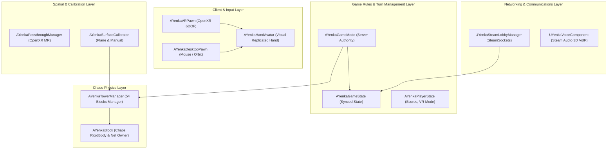
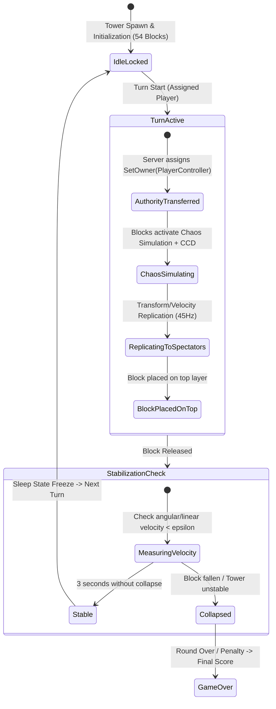
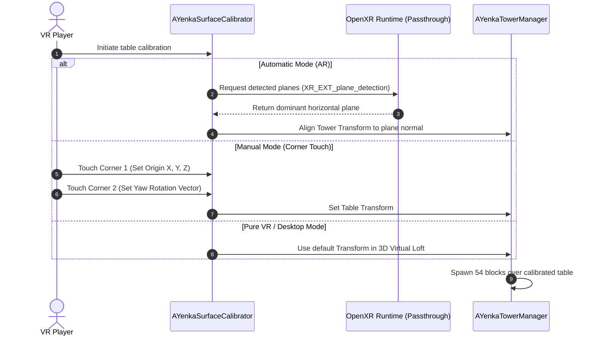
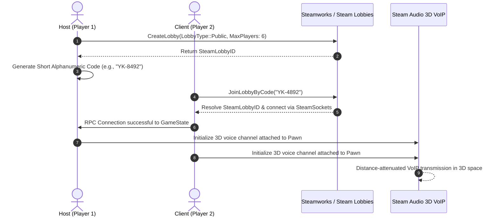

# System Architecture - YenkaVR

This document describes in depth the technical architecture, Unreal Engine 5 subsystems, networking model, and physics lifecycle implemented in **YenkaVR**.

---

## 1. High-Level Architecture Overview

---

## 2. Chaos Physics Lifecycle & Turn Authority

In a precision block-physics game, jitter and latency are critical. The physics architecture follows a strict state machine:

### Physical Material Properties (`UPhysicalMaterial`)
* **Mass per Block:** $0.085 \text{ kg}$ (Balsa/birch wood).
* **Static Friction ($\mu_s$):** $0.65$
* **Dynamic Friction ($\mu_d$):** $0.48$
* **Restitution ($e$):** $0.02$ (Near-zero bounce to prevent artificial jitter).
* **Continuous Collision Detection (CCD):** Enabled on all blocks.
* **Solver Iterations:** `PositionSolverIterationCount = 16`, `VelocitySolverIterationCount = 8`.

---

## 3. Spatial Calibration Pipeline & Mixed Reality (OpenXR)

---

## 4. Pawn Architecture & Hand Representation (VR vs No-VR)

* **`AYenkaVRPawn`:**
  * `UCameraComponent` bound to the HMD.
  * `UMotionControllerComponent` (Left and Right) with OpenXR Hand Tracking support.
  * Bimanual *Pinch-to-Zoom* and *World Drag* logic for spectators.
* **`AYenkaDesktopPawn`:**
  * `USpringArmComponent` + orbital `UCameraComponent`.
  * Mouse input for raycasting, horizontal hand lock, and `PhysicsHandle` extraction.
  * Dedicated **Finger Poke Action (`E` / `F`)** for guided longitudinal pushing of lower-level blocks.
* **`AYenkaHandAvatar`:**
  * 3D articulated hand mesh with procedural finger poses (`OpenHand`, `GrabPinch`, `FingerPoke`).
  * Network-replicated: smoothly interpolates position, rotation, and pose mode across all clients.

---

## 5. Network Architecture & Spatial VoIP

