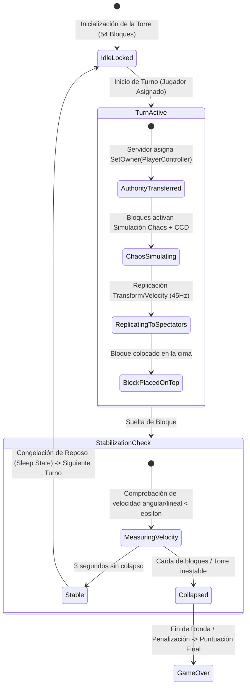
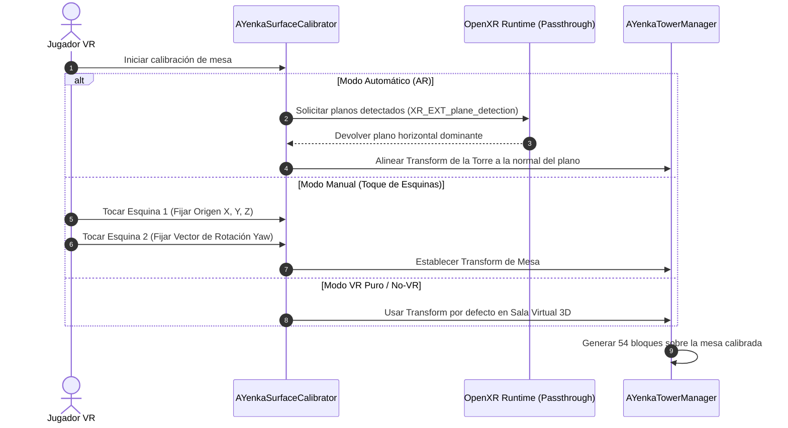
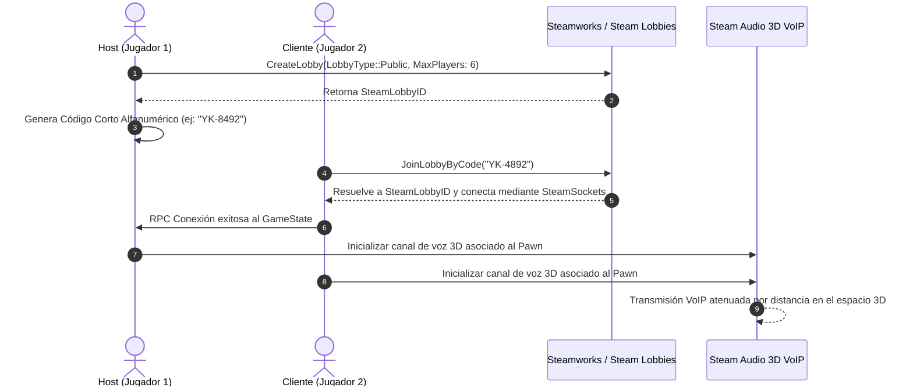

# Arquitectura del Sistema - YenkaVR

Este documento describe en profundidad la arquitectura técnica, los subsistemas de Unreal Engine 5, el modelo de red y el ciclo de vida de físicas implementados en **YenkaVR**.

---

## 1. Visión Global de la Arquitectura

---

## 2. Ciclo de Vida de Físicas Chaos y Autoridad de Turno

En un juego de física fina de bloques, el jitter y la latencia son críticos. La arquitectura de físicas sigue una máquina de estados estricta:

### Parámetros Físicos de los Bloques (`UPhysicalMaterial`)
* **Masa por Bloque:** $0.085 \text{ kg}$ (Madera de balsa/abedul).
* **Fricción Estática ($\mu_s$):** $0.65$
* **Fricción Dinámica ($\mu_d$):** $0.48$
* **Restitución ($e$):** $0.02$ (Cero rebote para evitar saltos artificiales).
* **Continuous Collision Detection (CCD):** Habilitado en todos los bloques.

---

## 3. Pipeline de Calibración Espacial y Realidad Mixta (OpenXR)

---

## 4. Arquitectura de Jugador y Representación de Manos (VR vs No-VR)

* **`AYenkaVRPawn`:**
  * Componente `UCameraComponent` ligado al HMD.
  * Componentes `UMotionControllerComponent` (Izquierda y Derecha) con soporte para OpenXR Hand Tracking.
  * Lógica bimanual de *Pinch-to-Zoom* y *World Drag* para espectadores.
* **`AYenkaDesktopPawn`:**
  * Componente `USpringArmComponent` + `UCameraComponent` orbital.
  * Entrada de ratón para cálculo de raycast de bloque y profundidad de empuje.
* **`AYenkaHandAvatar`:**
  * Malla 3D de mano con animación procedimental de dedos/pinza.
  * Replicado en red: interpola suavemente la posición enviada por el jugador (sea VR o No-VR).

---

## 5. Arquitectura de Red y VoIP Espacial

